# Information Architecture — Dr. Matheus Morari

**Versão**: 1.0
**Data**: 2026-07-09

---

## 1. Mapa do Site

```mermaid
graph TD
    HOME["/  Home"] --> BIO["/bio  Bio/Link Tree"]
    HOME --> CDR["/caminho-de-resolucao  Conversão"]
    HOME --> ATEND["/atendimentos  Atendimentos"]
    HOME --> PROD["/produtos  Produtos"]
    HOME --> CONT["/conteudos  Conteúdos"]
    HOME --> SOBRE["/sobre  Sobre"]
    HOME --> FORM["/formacao  Formação"]
    HOME --> SERV["/servicos  Serviços"]
    HOME --> DUV["/duvidas  Dúvidas"]
    HOME --> CONTATO["/contato  Contato"]

    ATEND --> ATEND1["/atendimentos/psicologia-para-homens"]
    ATEND --> ATEND2["/atendimentos/psicologia-sistemica"]
    ATEND --> ATEND3["/atendimentos/hipnoterapia"]

    PROD --> PROD1["/produtos/codigo-da-paz-conjugal"]
    PROD --> PROD2["/produtos/programa-de-inteligencia-emocional-para-homens"]
    PROD --> PROD3["/produtos/mapa-da-ansiedade-masculina"]
    PROD --> PROD4["/produtos/engrenagem-fantasma"]
    PROD --> PROD5["/produtos/codigo-h"]
    PROD --> PROD6["/produtos/mini-curso-de-saude-mental"]
    PROD --> LPP1["/lp/codigo-da-paz-conjugal"]
    PROD --> LPP2["/lp/programa-de-inteligencia-emocional-para-homens"]
    PROD --> LPP3["/lp/mapa-da-ansiedade-masculina"]
    PROD --> LPP4["/lp/engrenagem-fantasma"]
    PROD --> LPP5["/lp/codigo-h"]
    PROD --> LPP6["/lp/mini-curso-de-saude-mental"]

    CONT --> CONT1["/conteudos/[slug]"]

    CDR --> OBR["/obrigado  Pós-conversão"]

    LPP1 --> CDR
    LPP2 --> CDR
    LPP3 --> CDR
    LPP4 --> CDR
    LPP5 --> CDR
    LPP6 --> CDR
    LP["/lp/[slug]  Landing Pages de Produto"] --> CDR
    VSL["/vsl/[slug]  Video Sales"] --> OBR
```



---

## 2. Hierarquia de Navegação

### 2.1 Navegação Principal (Header)

```
┌────────────────────────────────────────────────────────────┐
│  Logo          Atendimentos  Conteúdos  Sobre    [CTA]    │
│                Serviços      Produtos   Formação           │
└────────────────────────────────────────────────────────────┘
```

**Menu desktop** (7 itens + CTA):
1. Atendimentos (dropdown com subpáginas)
2. Serviços
3. Conteúdos
4. Produtos
5. Sobre
6. Formação
7. Dúvidas
8. **[CTA] Caminho de Resolução** (botão dourado)

**Menu mobile**:
- Hamburger icon
- Overlay full-screen escuro
- Items empilhados com animação stagger
- CTA fixo no bottom

### 2.2 Navegação Secundária (Footer)

```
Colunas:
1. Marca (logo + frase-mãe + redes sociais)
2. Atendimentos (links para subpáginas)
3. Institucional (Sobre, Formação, Dúvidas, Contato)
4. Legal (Privacidade, Termos, CRP)
```

### 2.3 Navegação Contextual
- **Breadcrumb**: Em todas as páginas internas (exceto Home e Bio)
- **House Navigation**: Seção na Home mostrando os "cômodos" do ecossistema
- **CTAs contextuais**: Em cada página, CTAs que conduzem para o próximo passo lógico

---

## 3. Fluxos de Usuário

### 3.1 Fluxo Instagram (Persona Ricardo)
```
Instagram Story/Post
    → /bio (link na bio)
        → Clica "Iniciar Caminho de Resolução"
            → /caminho-de-resolucao
                → Preenche formulário
                    → /obrigado
                        → WhatsApp (equipe entra em contato)
```

### 3.2 Fluxo Google Orgânico (Persona Marcos)
```
Busca "psicólogo para homens ansiedade"
    → /conteudos/ansiedade-em-homens-que-lideram (artigo)
        → Lê artigo
            → CTA contextual: "Conhecer atendimentos"
                → /atendimentos
                    → /atendimentos/psicologia-para-homens
                        → CTA: "Iniciar Caminho de Resolução"
                            → /caminho-de-resolucao
```

### 3.3 Fluxo Tráfego Pago
```
Anúncio Meta/Google
    → /caminho-de-resolucao (direto)
        → Preenche formulário
            → /obrigado
```

### 3.4 Fluxo Esposa (Persona Carolina)
```
Busca "psicólogo para meu marido"
    → /sobre (Google)
        → Lê sobre abordagem
            → /atendimentos
                → Copia link e envia para o marido via WhatsApp
```

### 3.5 Fluxo Produto
```
Home/Bio/Conteúdo
    → /produtos
        → /lp/mapa-da-ansiedade-masculina
            → CTA: /caminho-de-resolucao
```

---

## 4. Taxonomia de Conteúdo

### 4.1 Categorias de Artigos
| Categoria | Slug | Descrição |
|-----------|------|-----------|
| Ansiedade | `ansiedade` | Ansiedade silenciosa, crises, sinais |
| Esgotamento | `esgotamento` | Burnout, exaustão, sobrecarga |
| Liderança | `lideranca` | Pressão de liderar, solidão no topo |
| Casamento e Família | `familia` | Relacionamento, presença, filhos |
| Padrões Familiares | `padroes` | Herança emocional, repetição |
| Mentalidade | `mentalidade` | Crenças, identidade, autoconhecimento |
| Autodomínio | `autodominio` | Governo emocional, controle |
| Homens que Lideram | `homens-lideram` | Conteúdo geral para o público-alvo |

### 4.2 Tipos de Produto
| Tipo | Descrição |
|------|-----------|
| Curso | Produto educacional em vídeo/módulos |
| Material | E-book, checklist, guia |
| Formação | Programas mais longos/aprofundados |

### 4.3 Tipos de Atendimento
| Tipo | Slug |
|------|------|
| Psicologia para Homens | `psicologia-para-homens` |
| Psicologia Sistêmica | `psicologia-sistemica` |
| Hipnoterapia | `hipnoterapia` |

---

## 5. Modelo de Dados (Supabase)

### 5.1 Tabelas e Relacionamentos

```
leads
├── id (UUID)
├── nome
├── whatsapp
├── email
├── dor_principal
├── identificacao
├── melhor_horario
├── origem
└── created_at

articles
├── id (UUID)
├── slug (UNIQUE)
├── title
├── description
├── category → taxonomia
├── content (MDX/Markdown)
├── cover_image
├── published
├── published_at
├── created_at
└── updated_at

products
├── id (UUID)
├── slug (UNIQUE)
├── name
├── description
├── price
├── type
├── status
├── cta_url
├── cover_image
└── created_at

faqs
├── id (UUID)
├── question
├── answer
├── category
├── sort_order
└── active
```

---

## 6. Prioridades de Implementação

### 6.1 Páginas por Prioridade

```
P0 (Crítico — Lançamento):
├── / (Home)
├── /bio
└── /caminho-de-resolucao

P1 (Essencial — Semana 1):
├── /atendimentos + 3 subpáginas
├── /sobre
└── /contato

P2 (Importante — Semana 2):
├── /servicos
├── /produtos + 6 páginas de produtos + 6 LPs de produtos
├── /formacao
└── /duvidas

P3 (Complementar — Semana 3):
├── /conteudos + /conteudos/[slug]
├── /obrigado
├── /lp/[slug] para campanhas futuras
└── /vsl/[slug]
```

---

## 7. Interlinking Strategy

### 7.1 Links Internos Obrigatórios
Cada página deve ter pelo menos:
- 1 link para `/caminho-de-resolucao` (conversão)
- 1 link para `/atendimentos` (serviço principal)
- 1 link contextual para conteúdo/produto relacionado

### 7.2 Mapa de Cross-linking

| Página | Linka para |
|--------|-----------|
| Home | Todas as seções principais |
| Bio | Caminho, Atendimentos, Curso, Conteúdos, WhatsApp |
| Caminho | Obrigado (após form) |
| Atendimentos | Subpáginas, Caminho, Contato |
| Subpáginas atend. | Caminho, Contato, FAQ |
| Conteúdos | Artigos, Atendimentos, Caminho |
| Artigos | Atendimentos relacionados, Caminho, Outros artigos |
| Produtos | Curso, Caminho, Atendimentos |
| Sobre | Formação, Atendimentos, Caminho |
| Formação | Atendimentos, Sobre |
| Serviços | Atendimentos, Produtos, Caminho |
| Dúvidas | Atendimentos, Contato, Caminho |
| Contato | WhatsApp, Caminho |
